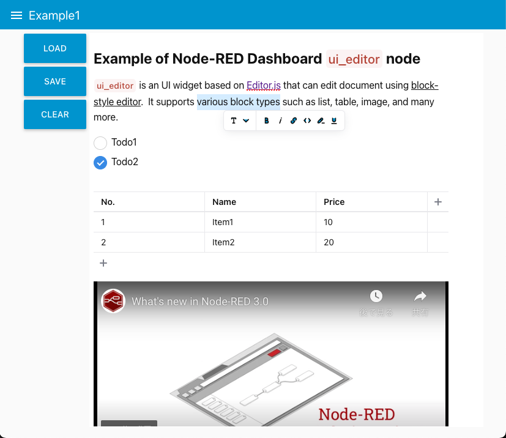
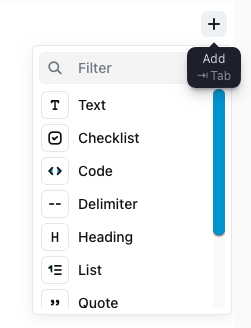
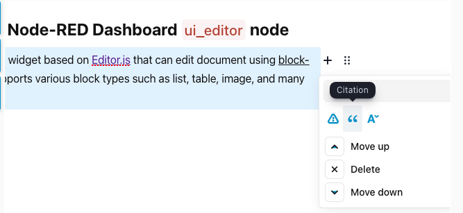
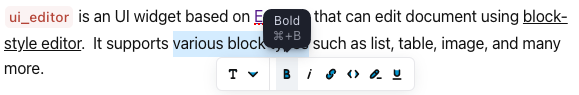

node-red-contrib-ui-editor
==========================

A Node-RED dashboard ui node for block-style editor implemented with [Editor.js](https://editorjs.io/).

## Install

Either use the Editor - Menu - Manage Palette - Install option, or run the following command in your Node-RED user directory (typically `~/.node-red`) after installing Node-RED-dashboard.

    npm i node-red-contrib-ui-editor

## Requirements
Node-RED v19.4 or greater
Node-RED-dashboard v2.13.0 or greater

## Usage

`ui_editor` widget displays an interactive block-style editor implemented by [Editor.js](https://editorjs.io/) on the Node-RED dashboard.

You can add new block by clicking add button ().

A block can tuned by clicking tune button ().

Inline tools can be invoked by selecting text. 

https://user-images.githubusercontent.com/30289092/233401827-e945885f-ae4b-4caf-bb67-37abb6a98fb9.mp4

The editor supports following plugins for blocks and inline tools:

- `@editorjs/paragraph` - text block tool
- `@editorjs/header` - header block tool
- `@editorjs/quote` - quotes block tool
- `@editorjs/warning` - warning tool for notification or appeals
- `@editorjs/delimiter` - delimiter tool
- `@editorjs/nested-list` - multi-level lists tool
- `@editorjs/checklist` - checklists tool
- `@editorjs/simple-image` - image reference tool
- `@editorjs/table` - table tool
- `@editorjs/code` - tool for code examples
- `@editorjs/raw` - tool for including raw HTMLs
- `editorjs/marker` - tool for highliting text fragments
- `editorjs/inline-code` - tool for marking code fragments
- `editorjs/underline` - tool for underlining text fragments
- `editorjs/text-variant-tune` - block tune for text variants`

Editor content can be controlled by including the following commands in the node's input message.

## Example

There are examples that you can import from the Node-RED editor menu:

**Import > Examples > node-red-contrib-ui-editor**
